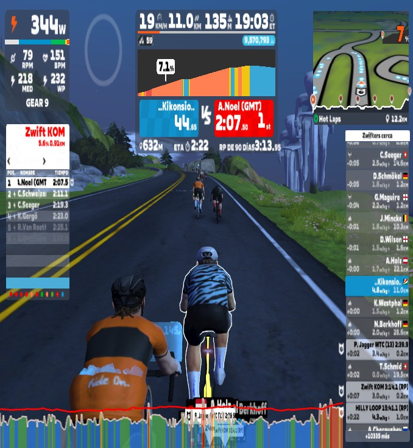

# PAC3: Visionant el futur amb les ulleres de Manovich.

## Casos d'hibridació: Strava i Zwift.

Autor: Enrique Barberà Ucher

Fecha: 17/12/2025

## Introducció

En aquesta tercera PAC analitze dos casos d’hibridació del programari que formen part del meu dia a dia com a aficionat a l’esport. L’objectiu és veure com aplicacions actuals combinen tècniques i elements que abans pertanyien a mons diferents, i com aquesta fusió acaba creant experiències noves que es viuen d’una manera molt natural. He triat **Strava** i **Zwift** perquè les utilitze des de fa anys i crec que encaixen molt bé amb aquesta mirada sobre la hibridació, sobretot tal com la planteja Manovich quan parla de nous formats que només poden existir dins del programari.

---

## Cas 1 - Strava: el cos com a dada i relat digital

Utilitze Strava pràcticament cada dia, siga corrent, en BTT o fent carretera. Ja és quasi una rutina: acabe l’activitat, pare el rellotge i, abans de ni beure un glop d’aigua, ja estic mirant com ha anat. Depén del dia em fixe en una cosa o una altra. Si faig carretera, la potència mitjana em diu molt ràpidament si he anat com volia. Si vaig per la muntanya, ja sé quins segments em picaran per dins, perquè n’hi ha alguns que m’han tingut obsessionat durant temporades. Altres dies simplement mire les pulsacions per comprovar si he anat dins del que tocava.

Aquesta manera tan natural de moure’m entre dades i sensacions és el que, a parer meu, fa que Strava siga molt més que un registre. Abans tot depenia de la intuïció: “hui he anat bé”, “hui he anat justet”, “hui he patit”. Ara, en canvi, tot queda enregistrat i es converteix en una mena de relat que després pots revisar. I això té la seua part emocional. Quan estic fort, em motiva veure com millore o com repetisc un segment més ràpid que mesos enrere. Però quan porte uns dies fluixos… ja sé que no és el moment de mirar massa gràfiques, perquè Strava no enganya.

També hi ha dies que Strava em fa eixir de casa quan no tenia gens de ganes. Em passa sobretot entre setmana: arribe cansat, però obri l’app i veig que un parell d’amics ja han penjat activitat. I només d’això ja em ve de gust fer alguna cosa. Curiosament, els “kudos” i tot això m’importen ben poc; de fet, quasi mai els mire. Però sí que note eixa sensació de comunitat, com si tots estiguérem connectats d’alguna manera.

Una de les coses que més valore és que Strava transforma qualsevol entrenament en un xicotet relat visual. El mapa, les dades, el ritme, com he gestionat les pujades… tot apareix d’una manera que em permet recordar exactament com em sentia. A voltes revise rutes de fa anys i em venen al cap records molt clars. És com un diari esportiu, però molt més complet perquè combina esforç real amb representació digital.

Per això crec que Strava és un bon exemple d’hibridació moderna: el cos, les dades, l’espai i la comunitat no estan per separat, sinó que formen una experiència única i coherent. És la manera actual d’entendre l’esport a través del programari.

## Cas 2 - Zwift: l'esport com a experiència simulada. Un nou epai esportiu.

Zwift s’ha convertit en una peça clau del meu entrenament, sobretot quan arriba l’hivern i els dies són tan curts que quasi no tens temps per res. Eixos dies que fas vida entre feina, fosca i fred, el rodillo i Zwift et salven la temporada. Però amb els anys he vist que això va més enllà de “fer rodillo”: és una manera nova de viure l’esport.

Quan entre en un dels mons virtuals de Zwift, (Watopia, Londres, París…), sempre tinc la sensació d’entrar en un espai que no existeix fora de la pantalla, però que, d’alguna manera, se sent real. Quan el camí puja, el rodillo es posa dur; quan baixes, afluixa; quan vas darrere d’un grup, notes una mica de "rebufo". Aquesta coherència entre el que fas amb les cames i el que veus a la pantalla fa que l’experiència siga molt més rica del que sembla.

Normalment participe en esdeveniments o workouts. Les curses, encara que siguen digitals, tenen un punt de tensió que no m’esperava. Quan veus que un grup s’escapa o que tens algú a rodes, t’esforces de veritat. I el millor és que acabes suat com si estiguérem al carrer. És una sensació curiosa, perquè saps que tot és virtual, però el cos respon igual.

Una cosa que valore molt és poder entrenar mentre mire una sèrie o escolte algun pòdcast llarg. A l’exterior això seria impensable, però a Zwift és part de la gràcia. Et permet combinar esforç i entreteniment d’una manera que s’adapta molt bé a la vida que portem.

L’altra part important és la sensació de pedalejar “amb gent”. No conec ningú personalment, però veure avatars d’altres ciclistes, avançar-ne uns, que altres et passen… crea una mena d’ambient social que no m’esperava. És com compartir espai, encara que cadascú estiga a casa seua.

Zwift no intenta copiar el món real. No és com altres apps que utilitzen vídeos de carreteres. Zwift inventa mons nous, i això el fa especial. És un espai esportiu propi, amb les seues regles i les seues sensacions. I crec que aquesta capacitat de crear un espai que només existeix gràcies al programari és el que el converteix en un exemple claríssim d’hibridació.

En resum, per a mi Zwift és una manera diferent d’entendre l’entrenament: una fusió d’esforç real i espai digital que fa que entrenar siga més flexible, més divertit i, sobretot, més possible quan les condicions no acompanyen.

---

### Bibliografia

- Manovich, Lev. *Software Takes Command*. Bloomsbury Academic, 2013.  
- Manovich, Lev. *The Language of New Media*. MIT Press, 2001.  
- Adell, Ferran. *Fonaments i evolució de la multimèdia*. UOC, 2024.  
- Gea, Miguel. *Herramientas y metodología crowdsourcing para la participación y creación colectiva de conocimiento abierto*, 2022.  
- McMillan, Robert. “Lord of the Files: How GitHub Tamed Free Software (And More)”, 2012.  
- Documentació oficial Strava — https://www.strava.com  
- Documentació oficial Zwift — https://www.zwift.com  

----

### Llicència

El contingut d’aquest repositori (text i imatges pròpies) es publica sota llicència  
**Creative Commons Reconeixement-NoComercial 4.0 Internacional (CC BY-NC 4.0)**.

Aquest repositori parteix de la plantilla `PEC3_Manovich_Reloaded` de Miguel Gea (llicència MIT).

